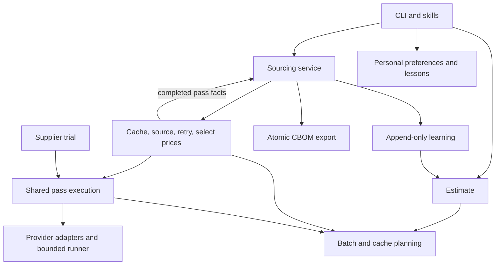

# Architecture

The agent buys nothing. It gathers price evidence, calculates the cheapest valid order, and exports a reviewable CBOM.

## Responsibilities

| Module | Responsibility |
| --- | --- |
| `cli.py` | Compose parsers, dispatch, classify errors, record safe command outcomes |
| `personal/store.py` | Read/update user folders and explicit lessons; resolve filenames |
| `personal/commands.py` | Display preferences, setup status and command outcome counts |
| `personal/startup.py` | Read consistent source snapshots, initialize folders/templates, check review status |
| `cbom/commands.py` | Translate CLI options and render service results |
| `cbom/service.py` | Load files, freeze learning, create a client only when needed, persist completed passes, export |
| `cbom/planning.py` | Shared batching, cache selection and recorded worker settings |
| `cbom/execution.py` | Execute one pass; normalize row errors and per-supplier evidence; shared by trials |
| `cbom/pipeline.py` | Combine cached/fresh quotes, retry once, select lowest totals in BOM order |
| `cbom/estimate.py` | Model a planned workload using prior provider-specific learning |
| `cbom/report.py` | Print estimates/results without writing learning data |
| `core/storage.py` | Atomic snapshots and template copies, locked JSONL appends, tolerant object-record reads |
| `learning/` | Derive token/cost estimates and supplier reliability from observations |
| `suppliers/` | Scout, preserve outside evidence, screen, trial, and apply authorized approvals |

Domain dependencies flow `suppliers → cbom → learning → core`; `personal → core`. Command adapters may also use personal preferences. Core, learning, and personal modules never import application command handlers.

## State and failure boundaries

| State | Ownership and behavior |
| --- | --- |
| Approved suppliers and source guide | Versioned repository policy |
| Personal choices and local facts | Per-user `memory.json`; shared rules and reusable fixes belong in skills/code or `AGENTS.md` |
| Completed API passes | Per-user `run_log.jsonl`; append-only; recorded before retry/export |
| Command outcomes | Per-user `events.jsonl`; fixed labels, excluding arguments and exception text |
| Cache and candidate registry | Per-user JSON snapshots; replaced atomically |
| CBOM | User-selected output folder; failed serialization preserves the previous export |

Cache-only exports create no API client and no new paid-pass learning record. All completed passes in a run are compared with the same pre-run learned state. If export fails after paid work, its pass records and successful quotes remain available.

Learning cannot reconstruct a request interrupted before a complete pass is returned. Command failures record that interruption separately. Atomic replacement prevents partial snapshots; it does not merge simultaneous edits to a cache or registry. Avoid overlapping mutating runs against one profile.

## Why these boundaries

| Previous coupling | Resulting boundary |
| --- | --- |
| Estimation imported the execution pipeline | Planning is shared independently of orchestration |
| Console reporting performed learning writes | The service records completed-pass facts; rendering only displays results |
| Personal preferences lived inside the API engine | Personal state has a separate package |
| Output failure discarded completed-pass learning | Pass observers record before retries and export |
| Fully cached runs constructed API clients | Service plans first and constructs clients only for fresh work |
| Snapshot writes truncated destinations immediately | Files are staged and replaced after successful serialization |

CLI names, BOM/CBOM columns, model selection, quote validation, price rules, supplier gates, and existing personal record formats remain compatible. Internal Python module locations changed; this project exposes the CLI as its interface.
